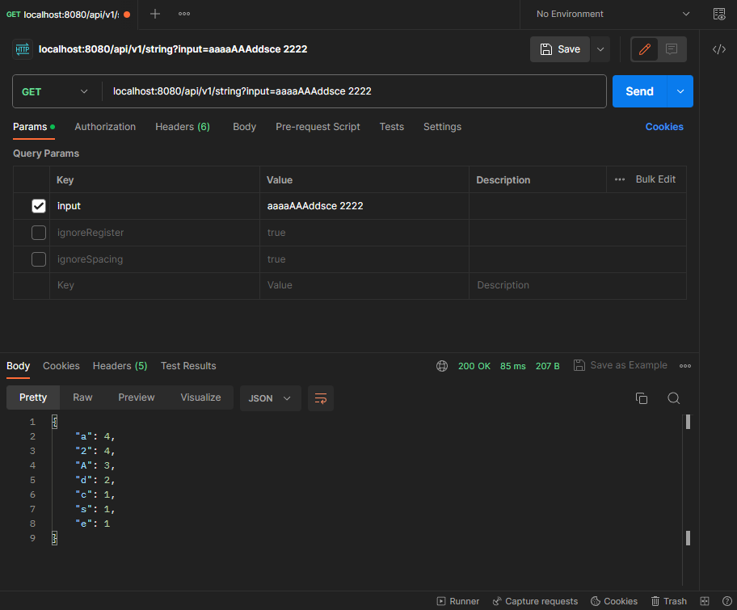
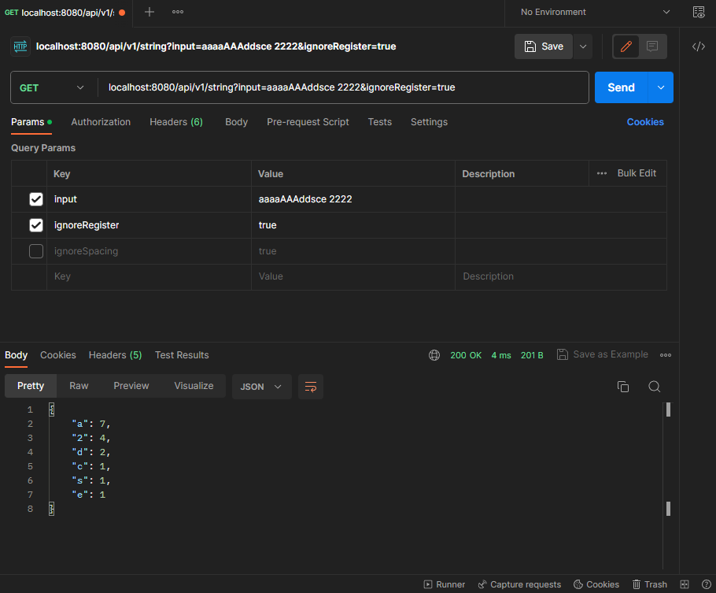
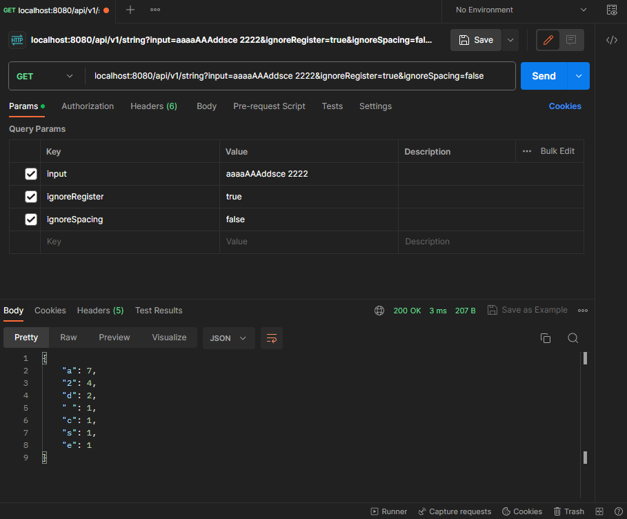

# Документация по запуску и параметрам
## Установка на локальный компьютер
- Скачать репозиторий;
- распаковать и открыть проект в IDE;
- запустить файл "TestTaskApplication.java", находящийся в "...\TestTask\src\main\java\com\example\testtask\".
## API и параметры
У приложения один ендпоинт - GET запрос на адрес "localhost:8080/api/v1/string".

**Параметры:**
- **input** - обязательный параметр, непосредственно входная строка.
- **ignoreRegister** - необязательный параметр (по умолчанию - false), игнорирует регистр символов входной строки.
- **ignoreSpacing** - необязательный параметр (по умолчанию - true), игнорирует пробелы в строке.

Ответом сервера является JSON файл с количеством вхождений символов в строку.

## Примеры

**ignoreRegister = true**

**ignoreRegister = true, ignoreSpacing = false**

